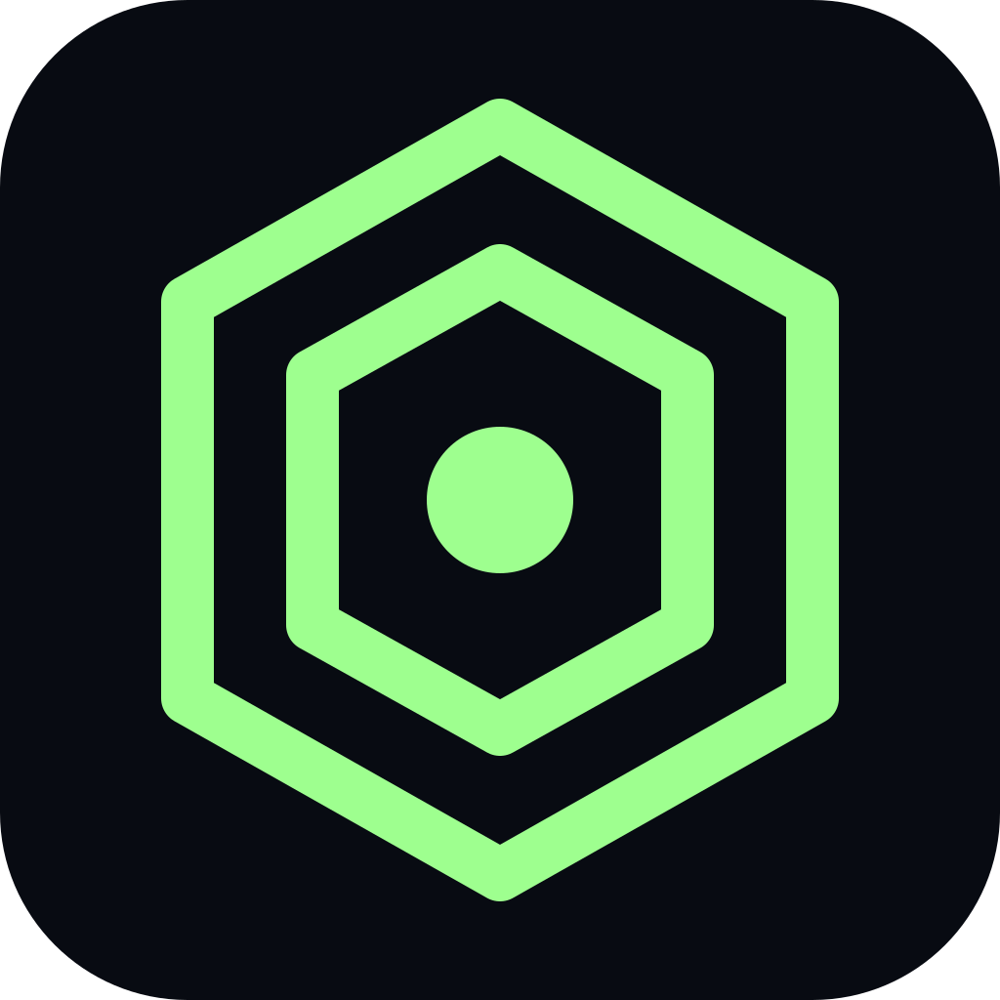
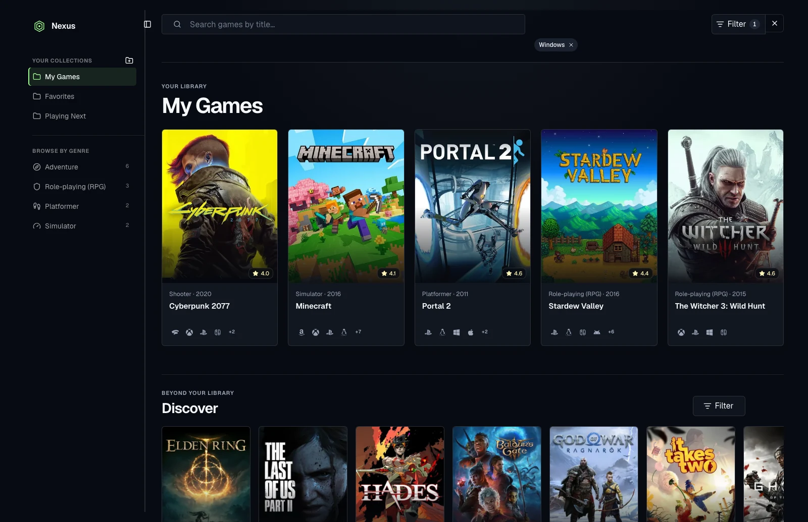

<p align="center">
  
</p>

<h1 align="center">Nexus Library</h1>

<p align="center">
  An installable spatial game library built with Next.js, WebSpatial, and IGDB.
</p>

<p align="center">
  <a href="https://nexus-library-six.vercel.app"></a>
  <a href="LICENSE"></a>
  <a href="https://nextjs.org"></a>
  <a href="https://www.npmjs.com/package/@webspatial/react-sdk"></a>
</p>

<p align="center">
  <strong>Actively developed demo and reference app.</strong><br>
  <a href="https://nexus-library-six.vercel.app">Open the live demo →</a>
</p>



## Features

- **Named local collections** — create, rename, delete, and organize collections without an account or database.
- **Smart genre collections** — browse deduplicated saved games in URL-addressable genre views derived from every user collection.
- **Catalog search** — find games by title through an authenticated, server-side IGDB proxy.
- **Faceted filters** — search and combine contextual genre and platform filters independently across the library, search results, and Discover.
- **Discover carousel** — browse a recent-popular selection when no search is active.
- **Detailed game pages** — view descriptions, release dates, ratings, critic scores, developers, publishers, and official links.
- **Platform identification** — scan accessible brand and fallback icons across current, legacy, and spatial platforms.
- **Screenshot lightbox** — open full-bleed screenshots with arrow controls, keyboard navigation, and a position counter.
- **Installable PWA** — add Nexus Library to a desktop or mobile home screen with a dedicated offline fallback.
- **Spatial game cards** — WebSpatial mode raises complete 50px cards while preserving the same artwork-above, metadata-below layout and dark theme.

## How It Works

```text
Browser / installed PWA
├── Collections ───────────────────────────────► localStorage
└── Search, Discover, and game details
    └── Next.js /api/games proxy
        ├── Twitch OAuth client-credentials flow
        └── IGDB API
```

The browser calls the Next.js route handler instead of IGDB directly. The server exchanges the configured Twitch client credentials for a short-lived access token, rate-limits upstream requests, and returns normalized game data. Twitch credentials and bearer tokens never enter the client bundle.

Collections are separate from the catalog flow. They are stored only in the current browser's `localStorage`, so they require no account and do not sync between browsers or devices.

## Tech Stack

- [Next.js 16](https://nextjs.org) App Router and React 19
- TypeScript 6 and Tailwind CSS 4
- [WebSpatial 1.7](https://www.npmjs.com/package/@webspatial/react-sdk)
- [IGDB API](https://api-docs.igdb.com/) with Twitch OAuth
- shadcn/ui, Base UI, Lucide, Font Awesome, and Simple Icons
- Vitest and Oxlint

## Prerequisites

- Node.js 22 or newer
- pnpm 10 or newer
- A Twitch developer application with **Client Type** set to **Confidential**
- An IGDB client ID and client secret from the [IGDB account setup guide](https://api-docs.igdb.com/#account-creation)

## Local Setup

```bash
git clone https://github.com/georgebutler/nexus-library.git
cd nexus-library
pnpm install
cp .env.example .env.local
```

Add your credentials to `.env.local`, then start the app:

```bash
pnpm dev
```

Open [http://localhost:3000](http://localhost:3000).

## Environment Variables

| Variable | Required | Description |
| --- | --- | --- |
| `IGDB_CLIENT_ID` | Yes | Client ID for your Confidential Twitch application. |
| `IGDB_CLIENT_SECRET` | Yes | Client secret used by the server-side Twitch OAuth flow. |

Both variables are server-only. Do not prefix them with `NEXT_PUBLIC_` or commit `.env.local`.

## Scripts

| Command | Purpose |
| --- | --- |
| `pnpm dev` | Start the Next.js development server. |
| `pnpm build` | Create a production build. |
| `pnpm start` | Serve the production build. |
| `pnpm lint` | Run Oxlint across the application and Next.js config. |
| `pnpm typecheck` | Run TypeScript without emitting files. |
| `pnpm test` | Run the Vitest suite once. |
| `pnpm spatial` | Launch WebSpatial Builder against `http://localhost:3000`. |

## WebSpatial Preview

Start Next.js in one terminal:

```bash
pnpm dev
```

Launch WebSpatial Builder in another:

```bash
pnpm spatial
```

The browser and spatial experiences share the same route and component tree. In spatial mode, the library uses a transparent outer workspace with separate dark sidebar and content panels that match the browser palette. Complete game cards sit 50px in front of the scrolling content panel and preserve the browser card layout, keeping artwork, metadata, and controls anchored together. Discover uses static five- or six-card page swaps instead of a transformed carousel, and game details keep the same dark visual system.

## PWA Behavior

Production builds register a service worker and provide a web app manifest, app icons, Apple touch metadata, and an installable standalone display mode. Deploy over HTTPS, then use your browser's **Install app** or **Add to Home Screen** action.

The service worker provides a small offline navigation page. It does **not** cache the IGDB catalog or make search, Discover, artwork, or game details available offline.

## Deploy to Vercel

1. Import this repository into [Vercel](https://vercel.com/new/clone?repository-url=https%3A%2F%2Fgithub.com%2Fgeorgebutler%2Fnexus-library).
2. Add `IGDB_CLIENT_ID` and `IGDB_CLIENT_SECRET` under **Project Settings → Environment Variables**.
3. Deploy with the default Next.js settings.

The `/api/games` route keeps credentials and generated bearer tokens on the server. Missing or invalid credentials produce a user-readable catalog error.

## Data and Privacy

- Collections and saved game records remain in `localStorage` in the current browser. Nexus Library has no account system or application database.
- Search, Discover, and detail requests pass through the deployed Next.js server to Twitch and IGDB.
- Clearing site data removes local collections. There is currently no built-in cloud sync or export.
- The offline page is an availability fallback; it does not make IGDB data available offline.
- The IGDB API is free for non-commercial use under its terms. Commercial projects require a commercial partnership with IGDB.

## Project Status

Nexus Library is an actively developed open-source demo and reference implementation. It is not a production, account-backed game service, and its data availability depends on IGDB and the configured Twitch application.

## Acknowledgements

Game metadata and media are provided by [IGDB](https://www.igdb.com/). Platform names, logos, game artwork, and other third-party trademarks belong to their respective owners. Their inclusion does not imply affiliation or endorsement.

## License

The repository's original code is available under the [MIT License](LICENSE). Third-party data, images, trademarks, logos, packages, and WebSpatial or IGDB services remain subject to their own licenses and terms.
